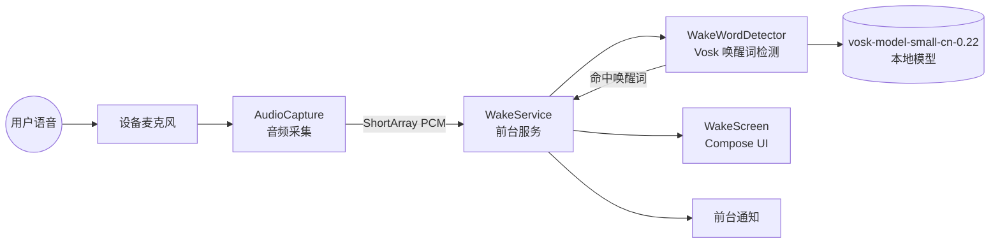
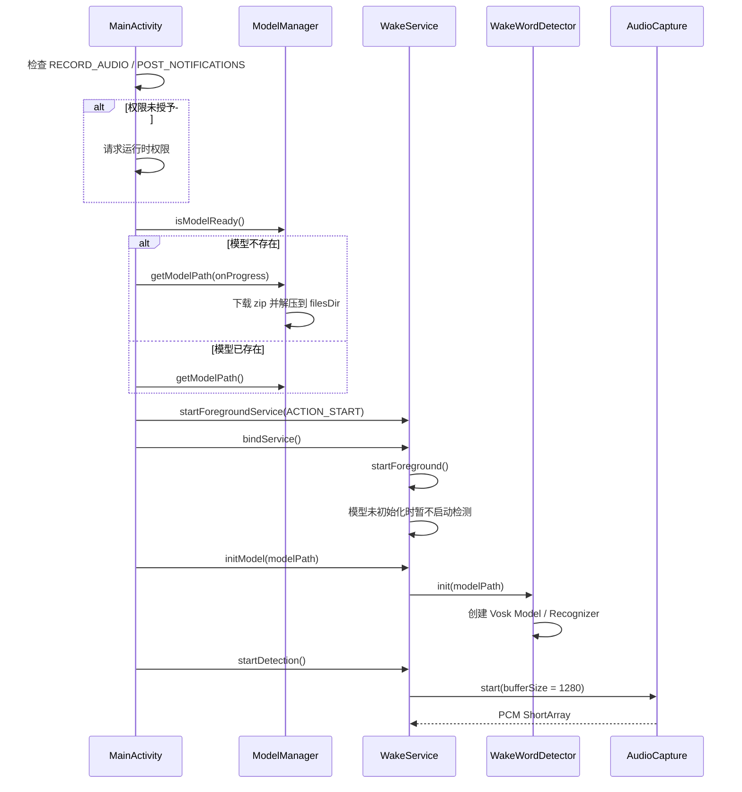
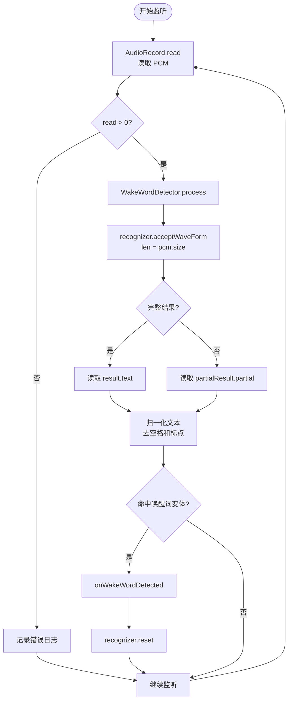
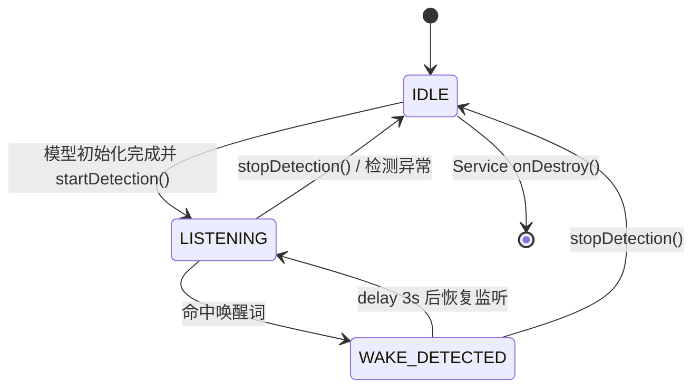
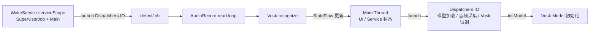

# 小立管家语音唤醒 Demo 概要设计

## 1. 背景与目标

本项目实现一个 Android 端离线语音唤醒 Demo。应用启动后以 `WakeService` 前台服务持续采集麦克风音频，使用 Vosk 中文模型进行本地流式识别。当识别结果命中“小立管家”或常见同音变体时，更新通知和界面状态，并累计唤醒次数。

设计目标：

- 离线运行，不依赖云端识别。
- 前台服务持续监听，适配 Android 后台麦克风限制。
- 使用 16kHz 单声道 16bit PCM 音频输入，匹配 Vosk 模型要求。
- 通过小词表 grammar 提升唤醒词命中率。
- 对模型、录音、识别链路提供可排查日志。

## 2. 总体架构



核心模块：

| 模块 | 文件 | 职责 |
| --- | --- | --- |
| `MainActivity` | `app/src/main/java/com/leelen/voicewake/MainActivity.kt` | 请求权限、下载/加载模型、启动和绑定前台服务、驱动 UI 状态 |
| `WakeService` | `app/src/main/java/com/leelen/voicewake/service/WakeService.kt` | 管理前台服务、检测协程、服务状态、通知和唤醒计数 |
| `AudioCapture` | `app/src/main/java/com/leelen/voicewake/audio/AudioCapture.kt` | 使用 `AudioRecord` 采集 16kHz PCM 音频 |
| `WakeWordDetector` | `app/src/main/java/com/leelen/voicewake/wake/WakeWordDetector.kt` | 初始化 Vosk 模型、处理音频帧、匹配唤醒词 |
| `ModelManager` | `app/src/main/java/com/leelen/voicewake/wake/ModelManager.kt` | 检查、下载、解压 Vosk 中文模型 |
| `WakeScreen` | `app/src/main/java/com/leelen/voicewake/ui/WakeScreen.kt` | 展示下载、初始化、监听、唤醒、错误等状态 |

## 3. 启动流程



关键点：

- Android 8.0 及以上使用 `startForegroundService()`。
- `WakeService` 创建前台通知后才执行长时间监听。
- 模型初始化完成前，`WakeService.startDetection()` 会直接返回，避免识别器未准备好时开始采集。
- Activity 绑定服务后，在 IO 线程初始化 Vosk 模型，再启动检测。

## 4. 唤醒检测流程



当前实现要点：

- `acceptWaveForm(pcm, pcm.size)` 的第二个参数必须是当前帧 sample 数，不能传采样率。
- partial 和 final 结果都会参与匹配，降低“必须等待一句完整话”的延迟。
- 识别文本会去除空格、中文标点和英文标点后匹配。
- Vosk grammar 使用分词形式，例如 `小丽 管家`、`小 李 管 家`，避免模型词表不认识 `小立管家` 这类合成词。

## 5. 服务状态机



状态含义：

| 状态 | 含义 |
| --- | --- |
| `IDLE` | 未监听或监听已停止 |
| `LISTENING` | 正在采集音频并检测唤醒词 |
| `WAKE_DETECTED` | 最近一次命中唤醒词，通知和 UI 展示“已唤醒” |

## 6. 线程与协程模型



约束：

- 模型加载是耗时操作，必须在 IO 线程执行。
- `AudioRecord.read()` 是阻塞式循环，放在 `Dispatchers.IO`。
- UI 通过 `StateFlow` 和 Compose state 展示状态。
- `detectJob` 取消时调用 `AudioCapture.stop()` 释放麦克风。

## 7. 权限与 Manifest

Manifest 中声明：

```xml
<uses-permission android:name="android.permission.RECORD_AUDIO" />
<uses-permission android:name="android.permission.INTERNET" />
<uses-permission android:name="android.permission.FOREGROUND_SERVICE" />
<uses-permission android:name="android.permission.FOREGROUND_SERVICE_MICROPHONE" />
<uses-permission android:name="android.permission.POST_NOTIFICATIONS" />
<uses-permission android:name="android.permission.WAKE_LOCK" />
```

服务声明：

```xml
<service
    android:name=".service.WakeService"
    android:exported="false"
    android:foregroundServiceType="microphone" />
```

运行时权限：

- `RECORD_AUDIO`：必须授权，否则无法采集麦克风。
- `POST_NOTIFICATIONS`：Android 13 及以上需要授权，否则前台通知可能不可见。

## 8. 模型管理

`ModelManager` 使用 `vosk-model-small-cn-0.22`：

- 首次启动时下载 zip。
- 下载到 `cacheDir`。
- 解压到 `filesDir/vosk-model-small-cn-0.22`。
- 后续启动检查 `conf` 目录存在即认为模型就绪。

模型路径示例：

```text
/data/user/0/com.leelen.voicewake/files/vosk-model-small-cn-0.22
```

## 9. 唤醒词策略

基础唤醒词：

```text
小立管家
```

常见同音变体：

```text
小李管家
小力管家
小丽管家
小立管理
小里管家
小理管家
小林管家
```

Grammar 分词短语：

```text
小立 管家
小李 管家
小力 管家
小丽 管家
小立 管理
小里 管家
小理 管家
小林 管家
小 立 管 家
小 李 管 家
小 力 管 家
小 丽 管 家
小 里 管 家
小 理 管 家
小 林 管 家
```

这样做的原因：

- Vosk 中文模型经常把“小立管家”识别为“小丽 管家”“小李 管家”等。
- Vosk grammar 依赖模型词表，直接传 `小立管家` 可能被认为是词表缺失。
- 使用分词短语后，模型能在小范围候选中选择更接近的结果。

## 10. 日志与排查

推荐过滤日志：

```bash
adb logcat -s MainActivity WakeService AudioCapture WakeWordDetector ModelManager VoskAPI AndroidRuntime
```

关键日志：

| 日志 | 含义 |
| --- | --- |
| `模型已存在` | 模型已解压到本地 |
| `加载模型` / `模型加载完成` | Vosk 初始化成功 |
| `开始采集` | 麦克风采集已启动 |
| `识别中: xxx` | Vosk partial 识别结果 |
| `匹配到唤醒词` | 已命中唤醒词变体 |
| `检测到唤醒词` | 服务已进入唤醒状态 |
| `监听异常` | 检测协程异常退出，需要看异常堆栈 |

已验证过的成功日志示例：

```text
WakeWordDetector: 识别中: 小丽 管家
WakeWordDetector: 匹配到唤醒词，原始识别文本: 小丽 管家
WakeService: 检测到唤醒词: 小立管家
```

常见问题：

| 现象 | 排查方向 |
| --- | --- |
| 没有 `开始采集` | 检查模型是否初始化、服务是否启动、录音权限是否授权 |
| `AudioRecord 初始化失败` | 检查麦克风权限、设备麦克风是否被其他应用占用 |
| 一直只有 `[unk]` | 检查 grammar 词表是否被 Vosk warning 忽略 |
| 能识别但不唤醒 | 查看 `识别中` 文本，补充同音变体或分词短语 |
| 后台一段时间后停止 | 检查系统电池优化、后台管理和前台通知是否存在 |

## 11. 构建与安装

构建 debug APK：

```bash
./gradlew :app:assembleDebug
```

安装到设备：

```bash
adb install -r app/build/outputs/apk/debug/app-debug.apk
```

手动授予权限：

```bash
adb shell pm grant com.leelen.voicewake android.permission.RECORD_AUDIO
adb shell pm grant com.leelen.voicewake android.permission.POST_NOTIFICATIONS
```

启动应用：

```bash
adb shell am start -n com.leelen.voicewake/.MainActivity
```

## 12. 后续优化建议

- 增加灵敏度配置，让现场可以选择“严格 / 平衡 / 灵敏”。
- 在 UI 上显示最近一次识别文本，便于调试唤醒词误识别。
- 增加本地音频回放测试入口，用固定 wav 验证识别链路。
- 将唤醒词变体配置化，避免每次改词都重新发版。
- 如果产品要求更低功耗和更高唤醒准确率，可评估专用 KWS 引擎替代通用 ASR 模型。
